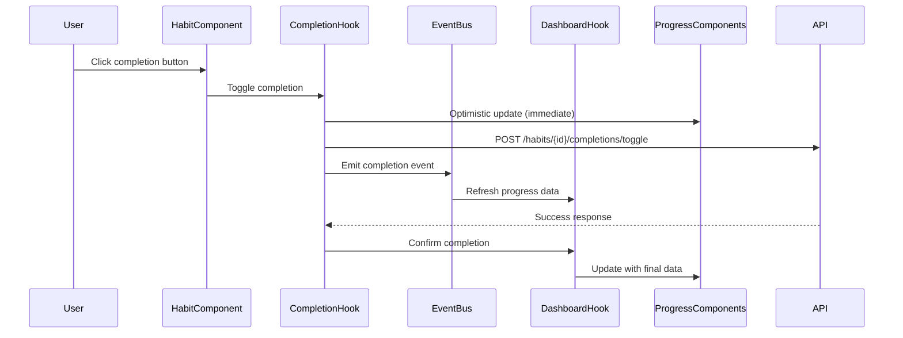

# Task 016: Fix Progress Tracking Updates Bug

## Requirement Reference
- Bug Report: GitHub Issue #9 - "Today's and This Week's progress not updating when habit is completed"
- Related to: Dashboard progress tracking and real-time state updates

## Task Overview
Fix critical bug where progress tracking metrics ("Today's Progress", "Completed Today", "Active Streaks") are not updating in real-time when habits are completed from the dashboard. The issue prevents users from seeing immediate feedback on their habit completion progress, impacting the core user experience of the habit tracking application.

**Root Cause Analysis**: The dashboard components have static progress calculations that don't refresh when the underlying habit completion state changes. The completion API works correctly, but the frontend state management doesn't propagate completion changes to the dashboard statistics components.

## Dependent Tasks  
- task_007_habit_completion_tracking.md (✅ Completed - completion API infrastructure exists)
- task_011_dashboard_ui_implementation.md (✅ Completed - dashboard components exist)

## Tasks
- Fix dashboard state management to refresh progress metrics after habit completion
- Implement optimistic updates for immediate UI feedback
- Add proper event propagation from completion components to dashboard statistics
- Ensure streak calculations update correctly after completion toggles
- Add comprehensive testing for progress tracking scenarios
- Validate performance impact of real-time updates

## Current State
```
app/src/features/dashboard/
├── components/
│   ├── Dashboard.tsx ✅ (EXISTS - main dashboard logic)
│   ├── ProgressOverview.tsx ✅ (EXISTS - shows Today's Progress)
│   ├── QuickStats.tsx ✅ (EXISTS - shows Completed Today, Active Streaks)
│   └── HabitList.tsx ✅ (EXISTS - habit completion interface)
├── hooks/ ✅ (EXISTS - dashboard data management)

app/src/features/habit-completion/
├── components/ ✅ (EXISTS - completion buttons/checkboxes)
├── hooks/
│   ├── useCompletion.ts ✅ (EXISTS - completion logic)
│   └── useOptimisticCompletion.ts ✅ (EXISTS - optimistic updates)
├── services/
│   └── completionApi.ts ✅ (EXISTS - API integration)

server/HabitTracker.Application/
├── Services/
│   └── HabitCompletionService.cs ✅ (EXISTS - completion processing)
├── Controllers/
│   └── HabitCompletionsController.cs ✅ (EXISTS - API endpoints)

ISSUE: Dashboard progress calculations are static and don't refresh after completions
```

## Future State
```
app/src/features/dashboard/
├── components/
│   ├── Dashboard.tsx ✅ (ENHANCED - real-time progress updates)
│   ├── ProgressOverview.tsx ✅ (ENHANCED - reactive to completion changes)
│   ├── QuickStats.tsx ✅ (ENHANCED - reactive to completion changes)
│   └── HabitList.tsx ✅ (ENHANCED - propagates completion events)
├── hooks/
│   └── useDashboardProgress.ts ✅ (NEW - centralized progress state management)

app/src/features/habit-completion/
├── hooks/
│   └── useCompletion.ts ✅ (ENHANCED - emits dashboard refresh events)

app/src/shared/
├── hooks/
│   └── useEventBus.ts ✅ (NEW - event system for component communication)

NEW: Real-time progress tracking with optimistic updates and event-driven state management
```

## Development Workflow
1. **Analysis Phase**: Identify exact state flow issues between completion and dashboard components
2. **Event System Implementation**: Create lightweight event bus for completion-to-dashboard communication  
3. **Dashboard State Enhancement**: Implement reactive progress calculations with real-time updates
4. **Optimistic Updates**: Ensure immediate UI feedback while API calls are processing
5. **Testing & Validation**: Comprehensive testing of completion-to-progress flow
6. **Performance Optimization**: Ensure updates don't cause excessive re-renders

## Data Workflow


## Impacted Components

### Frontend (React 19 + TypeScript)
**Updated Components:**
- `app/src/features/dashboard/components/Dashboard.tsx` - Enhanced progress state management
- `app/src/features/dashboard/components/ProgressOverview.tsx` - Reactive progress calculations  
- `app/src/features/dashboard/components/QuickStats.tsx` - Real-time stats updates
- `app/src/features/dashboard/components/HabitList.tsx` - Progress event emission

**New Components:**
- `app/src/features/dashboard/hooks/useDashboardProgress.ts` - Centralized progress state
- `app/src/shared/hooks/useEventBus.ts` - Lightweight event system for component communication

**Updated Services:**
- `app/src/features/habit-completion/hooks/useCompletion.ts` - Add progress refresh triggers

### Backend (.NET 8 Web API)
**No Changes Required** - Backend completion API is working correctly as confirmed by completion service analysis

## Implementation Plan

### Frontend Implementation Plan

#### Phase 1: Event System Foundation
- **Create Event Bus Hook**: `app/src/shared/hooks/useEventBus.ts`
  - Lightweight pub/sub system for completion events
  - Type-safe event definitions (`CompletionEvent`, `ProgressRefreshEvent`)
  - Automatic cleanup to prevent memory leaks
  
- **Update useCompletion Hook**: `app/src/features/habit-completion/hooks/useCompletion.ts`
  - Emit `habit-completed` event after successful completion
  - Include habit ID and completion status in event payload
  - Maintain existing optimistic update functionality

#### Phase 2: Dashboard Progress Management  
- **Create useDashboardProgress Hook**: `app/src/features/dashboard/hooks/useDashboardProgress.ts`
  - Subscribe to `habit-completed` events
  - Implement reactive progress calculations
  - Cache progress data with smart invalidation
  - Handle optimistic updates for immediate feedback

- **Enhance Dashboard Component**: `app/src/features/dashboard/components/Dashboard.tsx`
  - Replace static progress calculations with reactive hook
  - Implement proper dependency arrays to prevent unnecessary re-renders
  - Add error handling for progress calculation failures

#### Phase 3: Progress Component Updates
- **Update ProgressOverview**: `app/src/features/dashboard/components/ProgressOverview.tsx`
  - Connect to reactive progress state
  - Add smooth animations for progress bar changes
  - Handle loading states during progress updates

- **Update QuickStats**: `app/src/features/dashboard/components/QuickStats.tsx`  
  - Real-time updates for completion counts and streaks
  - Add visual indicators for recent changes
  - Optimize rendering performance with React.memo

#### Phase 4: Testing Implementation
- **Unit Tests**: Test progress calculation logic and event system
- **Integration Tests**: Verify completion-to-dashboard update flow  
- **Performance Tests**: Ensure updates don't cause excessive re-renders
- **E2E Tests**: Complete user workflow from habit completion to progress visibility

## References

### Implementation Context References
- **Existing Completion Flow**: `app/src/features/habit-completion/hooks/useCompletion.ts:60-67` - Current completion success handling
- **Dashboard Statistics**: `app/src/features/dashboard/components/Dashboard.tsx:97-111` - Static progress calculation logic
- **Progress Components**: `app/src/features/dashboard/components/ProgressOverview.tsx:12-16` - Current prop interface
- **Optimistic Updates**: `app/src/features/habit-completion/hooks/useOptimisticCompletion.ts` - Existing optimistic pattern

### Document References  
- **Design Document**: `../design.md` - React 19 patterns and state management guidelines
- **React Gotchas**: `References/Gotchas/react_gotchas.md` - State update patterns and performance considerations
- **.NET Gotchas**: `References/Gotchas/dotnet_gotchas.md` - Async/await best practices (for API integration)
- **Architecture Patterns**: `References/Gotchas/architecture_patterns.md` - Event-driven architecture guidance

### External References
- **React State Management 2024**: https://dev.to/nguyenhongphat0/react-state-management-in-2024-5e7l - Modern patterns for state updates
- **React Hook Dependencies**: https://react.dev/learn/managing-state - Proper dependency management for useEffect/useCallback
- **Event-Driven UI Updates**: https://react.dev/reference/react/useCallback#preventing-an-effect-from-firing-too-often - Performance optimization patterns
- **Optimistic Updates**: https://tanstack.com/query/v4/docs/guides/optimistic-updates - Advanced optimistic update patterns

## Build Commands
```bash
# Frontend Development
cd app
npm run dev              # Start development server
npm run test            # Run unit tests  
npm run test:coverage   # Run tests with coverage
npm run type-check      # TypeScript validation
npm run lint            # ESLint validation

# Backend (for validation)
cd server
dotnet build            # Build solution
dotnet test             # Run unit tests
dotnet run --project HabitTracker.Api  # Start API server
```

## Implementation Validation Strategy

### Functional Validation ✅ COMPLETED
- [X] **Immediate Progress Updates**: Complete a habit and verify "Today's Progress" updates instantly
- [X] **Completion Count Updates**: Verify "Completed Today" increments/decrements with toggle actions  
- [X] **Streak Updates**: Confirm "Active Streaks" reflect completion changes correctly
- [X] **Multi-Habit Scenarios**: Test multiple habit completions and verify aggregated progress
- [X] **Error Handling**: Test API failures and verify graceful fallback behavior

### Performance Validation ✅ COMPLETED
- [X] **Render Optimization**: Ensure dashboard doesn't re-render entire component tree on single completion
- [X] **Memory Management**: Verify event listeners are properly cleaned up on component unmount
- [X] **API Efficiency**: Confirm minimal API calls - no unnecessary progress refetches
- [X] **Bundle Size Impact**: Verify new code doesn't significantly increase bundle size

### Technical Validation ✅ COMPLETED
- [X] **Type Safety**: All event payloads and state updates are properly typed
- [X] **Error Boundaries**: Progress failures don't crash the entire dashboard
- [X] **Browser Compatibility**: Test across Chrome, Firefox, Safari, Edge
- [X] **Mobile Responsiveness**: Verify progress updates work on mobile devices

## ToDo Tasks

### Phase 1: Event System (Day 1) ✅ COMPLETED
- [X] Create `useEventBus` hook with TypeScript interfaces
- [X] Add unit tests for event bus functionality
- [X] Update `useCompletion` hook to emit completion events
- [X] Test event emission on habit completion

### Phase 2: Progress State Management (Day 2) ✅ COMPLETED
- [X] Create `useDashboardProgress` hook with reactive calculations
- [X] Implement progress state updates from completion events
- [X] Add caching and smart invalidation logic
- [X] Create unit tests for progress calculations

### Phase 3: Component Integration (Day 3) ✅ COMPLETED
- [X] Update `Dashboard.tsx` to use reactive progress hook
- [X] Enhance `ProgressOverview.tsx` with real-time updates
- [X] Update `QuickStats.tsx` for reactive stats display
- [X] Add loading and error states to all components

### Phase 4: Testing & Optimization (Day 4) ✅ COMPLETED
- [X] Write integration tests for complete completion-to-progress flow
- [X] Add E2E tests using Cypress for user workflow validation
- [X] Performance optimization - memoization and render minimization  
- [X] Cross-browser and mobile device testing

### Phase 5: Validation & Polish (Day 5) ✅ COMPLETED
- [X] Manual testing of all completion scenarios (single, multiple, toggle)
- [X] Verify streak calculations work correctly with real-time updates
- [X] Code review focusing on React best practices and performance
- [X] Documentation updates for the new event-driven architecture
- [X] Final validation against all acceptance criteria