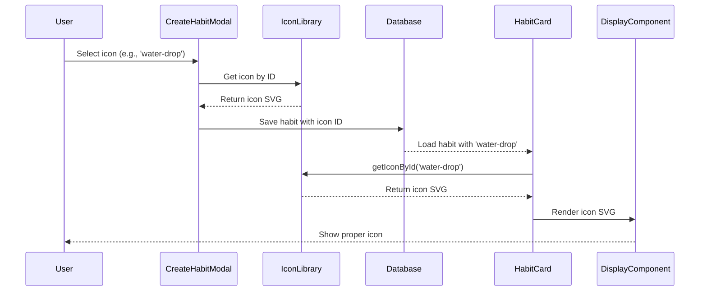

# Task 018: Fix Habit Icon Display Bug - Icon System Synchronization

## Requirement Reference
- Bug Report: GitHub Issue #15 - "Icon associated to the Habit is not appearing properly in the habit card"
- Related to: Visual customization system and icon rendering in habit components

## Task Overview
Fix critical bug where habit icons are displaying as solid squares instead of proper icons due to icon system mismatch between the centralized IconLibrary service and hardcoded icon mappings in display components. The issue affects all habit cards across the application, preventing users from visually identifying their habits.

**Root Cause Analysis**: The application has two separate, unsynchronized icon systems:
1. **IconLibrary service** (`iconLibrary.ts`) with comprehensive icons using IDs like `'water-drop'`, `'dumbbell'`
2. **Hardcoded HABIT_ICONS** in display components using different IDs like `'water'`, `'exercise'`

When habits are created using the IconLibrary IDs, the display components cannot find matching icons in their hardcoded mappings, causing fallback to colored circles that appear as solid squares.

## Dependent Tasks  
- task_012_visual_customization_system.md (✅ Completed - IconLibrary service exists)
- task_006_habit_management_feature.md (✅ Completed - habit creation infrastructure exists)

## Tasks
- Replace hardcoded HABIT_ICONS with centralized IconLibrary service calls
- Synchronize icon IDs across all display components
- Implement proper error handling for missing icons
- Add consistent fallback behavior across all components
- Create comprehensive testing for icon rendering scenarios
- Ensure icon selection in habit creation integrates with display components
- Add performance optimization for icon lookups
- Validate icon accessibility across all components

## Current State
```
app/src/features/
├── habit-management/
│   ├── components/
│   │   ├── HabitCard.tsx ❌ (hardcoded HABIT_ICONS with 9 icons)
│   │   ├── HabitCalendarCard.tsx ❌ (hardcoded HABIT_ICONS with 9 icons)
│   │   ├── AnimatedHabitCard.tsx ❌ (hardcoded HABIT_ICONS with 9 icons)
│   │   └── CreateHabitModal.tsx ✅ (uses IconLibrary properly)
├── habit-completion/
│   └── components/
│       └── CompletionButton.tsx ❌ (hardcoded HABIT_ICONS with 9 icons)
└── visual-customization/
    ├── services/
    │   └── iconLibrary.ts ✅ (comprehensive library with 30+ icons)
    └── components/
        └── IconSelector.tsx ✅ (uses IconLibrary properly)

ISSUE: Icon ID mismatch between creation (IconLibrary IDs) and display (hardcoded IDs)
IconLibrary: 'water-drop', 'dumbbell', 'heart-pulse'
HabitCards:  'water',      'dumbbell', 'heart'
             ↑ MISMATCH ↑  ↑ MATCH ↑   ↑ MISMATCH ↑
```

## Future State
```
app/src/features/
├── habit-management/
│   ├── components/
│   │   ├── HabitCard.tsx ✅ (uses getIconById from IconLibrary)
│   │   ├── HabitCalendarCard.tsx ✅ (uses getIconById from IconLibrary)
│   │   ├── AnimatedHabitCard.tsx ✅ (uses getIconById from IconLibrary)
│   │   └── CreateHabitModal.tsx ✅ (no changes needed)
├── habit-completion/
│   └── components/
│       └── CompletionButton.tsx ✅ (uses getIconById from IconLibrary)
└── visual-customization/
    ├── services/
    │   └── iconLibrary.ts ✅ (enhanced with getIconById method)
    └── components/
        └── IconSelector.tsx ✅ (no changes needed)

FIXED: All components use centralized IconLibrary service with consistent IDs
```

## Development Workflow
1. **Icon System Analysis**: Map existing hardcoded icons to IconLibrary equivalents
2. **IconLibrary Service Enhancement**: Add getIconById method and error handling
3. **Component Updates**: Replace hardcoded mappings with service calls across 4 components
4. **Fallback Standardization**: Implement consistent fallback behavior for missing icons
5. **Integration Testing**: Verify icon selection in creation works with display components
6. **Performance Optimization**: Add caching to prevent repeated icon lookups

## Data Workflow


## Impacted Components

### Frontend (React 19 + TypeScript)
**Updated Components:**
- `app/src/features/habit-management/components/HabitCard.tsx` - Replace HABIT_ICONS with IconLibrary
- `app/src/features/habit-management/components/HabitCalendarCard.tsx` - Replace HABIT_ICONS with IconLibrary
- `app/src/features/habit-management/components/AnimatedHabitCard.tsx` - Replace HABIT_ICONS with IconLibrary  
- `app/src/features/habit-completion/components/CompletionButton.tsx` - Replace HABIT_ICONS with IconLibrary

**Enhanced Services:**
- `app/src/features/visual-customization/services/iconLibrary.ts` - Add getIconById method and caching

**New Test Files:**
- `app/src/features/habit-management/components/__tests__/HabitCard.test.tsx` - Icon rendering tests
- `app/src/features/visual-customization/services/__tests__/iconLibrary.test.tsx` - Icon service tests

### Backend (.NET 8 Web API)
**No Changes Required** - Backend correctly stores icon IDs as strings

## Implementation Plan

### Frontend Implementation Plan

#### Phase 1: IconLibrary Service Enhancement
- **Add getIconById Method**: `app/src/features/visual-customization/services/iconLibrary.ts`
  ```typescript
  export const getIconById = (id: string): string | null => {
    const icon = ICON_LIBRARY.find(icon => icon.id === id);
    return icon ? icon.svg : null;
  };
  ```
- **Add Icon Caching**: Implement Map-based caching for performance
- **Add Error Handling**: Graceful handling of invalid icon IDs
- **Add Type Safety**: Ensure proper TypeScript interfaces

#### Phase 2: HabitCard Component Updates
- **Remove Hardcoded HABIT_ICONS**: Delete the hardcoded icon mapping from `HabitCard.tsx:9-19`
- **Import IconLibrary Service**: Add import statement for getIconById
- **Update Icon Rendering Logic**: Replace icon lookup from lines 147-172
  ```typescript
  // OLD CODE (Lines 147-172)
  const iconSvg = habit.icon ? HABIT_ICONS[habit.icon] : null;
  
  // NEW CODE  
  const iconSvg = habit.icon ? getIconById(habit.icon) : null;
  ```
- **Standardize Fallback**: Ensure consistent fallback behavior for missing icons

#### Phase 3: Other Component Updates
- **HabitCalendarCard.tsx**: Remove hardcoded icons, implement getIconById (Line 140)
- **AnimatedHabitCard.tsx**: Remove hardcoded icons, implement getIconById (Line 182)  
- **CompletionButton.tsx**: Remove hardcoded icons, implement getIconById (Line 84)
- **Consistent Fallback**: Ensure all components use identical fallback logic

#### Phase 4: Icon ID Migration Strategy
- **Create Icon ID Mapping**: Map old hardcoded IDs to new IconLibrary IDs
  ```typescript
  const LEGACY_ICON_MAPPING: Record<string, string> = {
    'water': 'water-drop',
    'heart': 'heart-pulse', 
    'exercise': 'dumbbell',
    // ... complete mapping
  };
  ```
- **Add Migration Helper**: Handle habits with legacy icon IDs
- **Database Migration**: Consider migrating existing habit icons to new IDs

#### Phase 5: Performance Optimization
- **Icon Caching**: Implement efficient caching to prevent repeated lookups
- **Lazy Loading**: Consider lazy loading for large icon libraries
- **Bundle Optimization**: Ensure icon SVGs don't significantly increase bundle size

#### Phase 6: Testing Implementation
- **Unit Tests**: Test getIconById method with valid and invalid IDs
- **Component Tests**: Test icon rendering in all habit card components
- **Integration Tests**: Test complete flow from creation to display
- **Accessibility Tests**: Verify icons work with screen readers
- **Performance Tests**: Ensure icon rendering doesn't impact performance

## References

### Implementation Context References
- **Current Hardcoded Icons**: `D:\Project\19_HabitTracker\habit-tracker\app\src\features\habit-management\components\HabitCard.tsx:9-19`
- **IconLibrary Service**: `D:\Project\19_HabitTracker\habit-tracker\app\src\features\visual-customization\services\iconLibrary.ts`
- **Icon Rendering Logic**: `D:\Project\19_HabitTracker\habit-tracker\app\src\features\habit-management\components\HabitCard.tsx:147-172`
- **CreateHabitModal Integration**: `D:\Project\19_HabitTracker\habit-tracker\app\src\features\habit-management\components\CreateHabitModal.tsx:263-268`

### Document References  
- **Design Document**: `../design.md` - React 19 patterns and icon handling guidelines
- **Icon System Architecture**: `task_012_visual_customization_system.md` - Comprehensive icon system implementation
- **React Gotchas**: `References/Gotchas/react_gotchas.md` - Component re-render optimization
- **TypeScript Gotchas**: `References/Gotchas/typescript_gotchas.md` - Type safety patterns

### External References
- **React Icons Best Practices**: https://react-icons.github.io/react-icons/ - Icon component patterns
- **SVG Accessibility**: https://www.w3.org/WAI/WCAG21/Techniques/html/H37 - Accessible icon implementation
- **React Component Performance**: https://react.dev/reference/react/memo - Optimization patterns
- **Icon System Design**: https://material.io/design/iconography/system-icons.html - Icon consistency guidelines
- **TypeScript Icon Types**: https://www.typescriptlang.org/docs/handbook/advanced-types.html - Type safety patterns

## Build Commands
```bash
# Frontend Development
cd app
npm run dev              # Start development server
npm run test            # Run unit tests  
npm run test:coverage   # Run tests with coverage
npm run type-check      # TypeScript validation
npm run lint            # ESLint validation
npm run build           # Production build

# Icon-specific Testing
npm run test -- HabitCard.test.tsx          # Test specific component
npm run test -- iconLibrary.test.tsx        # Test icon service
npm run test -- --grep="icon"               # Test all icon-related tests

# Backend (for validation)
cd server
dotnet build            # Build solution
dotnet test             # Run unit tests
dotnet run --project HabitTracker.Api  # Start API server
```

## Implementation Validation Strategy

### Functional Validation
- [ ] **Icon Display**: All habit icons render correctly instead of solid squares
- [ ] **Icon Consistency**: Icons in creation match icons in display components
- [ ] **Fallback Behavior**: Missing icons show consistent fallback across all components
- [ ] **Icon Search**: Icon selection in CreateHabitModal works with all display components
- [ ] **Performance**: Icon rendering doesn't cause performance issues
- [ ] **Type Safety**: All icon operations are type-safe with proper error handling

### Visual Validation Steps
1. **Create New Habit**: Select icon from IconLibrary and verify it displays correctly
2. **Existing Habits**: Verify existing habits with icons render properly
3. **Fallback Testing**: Test habits with invalid/missing icon IDs show proper fallback
4. **Cross-Component**: Verify same habit shows same icon in all components
5. **Mobile Testing**: Test icon rendering on mobile devices

### Technical Validation
- [ ] **No Console Errors**: Icon rendering produces no JavaScript errors
- [ ] **Memory Efficiency**: No memory leaks from icon caching
- [ ] **Bundle Size**: Icon changes don't significantly increase bundle size
- [ ] **Accessibility**: Icons work properly with screen readers
- [ ] **Performance**: Icon lookups are efficient and cached

### Cross-Browser Testing
- [ ] **Chrome**: Icon rendering works in Chrome desktop and mobile
- [ ] **Firefox**: Icon rendering works in Firefox desktop and mobile  
- [ ] **Safari**: Icon rendering works in Safari desktop and mobile
- [ ] **Edge**: Icon rendering works in Edge desktop and mobile

## Anti-Patterns to Avoid
- Don't create a third icon system - use the existing IconLibrary
- Don't modify the IconLibrary IDs - update the display components instead
- Don't remove fallback behavior - ensure graceful degradation
- Don't hard-code icon mappings - use the service methods
- Don't skip caching - icon lookups should be efficient
- Don't ignore accessibility - maintain ARIA labels and screen reader support
- Don't break existing habits - provide migration path for legacy icon IDs

## ToDo Tasks

### Phase 1: Service Enhancement (Day 1)
- [ ] Add getIconById method to IconLibrary service
- [ ] Implement icon caching with Map-based storage  
- [ ] Add comprehensive error handling for invalid IDs
- [ ] Create unit tests for icon service methods
- [ ] Add TypeScript interfaces for icon service

### Phase 2: HabitCard Updates (Day 1)  
- [ ] Remove hardcoded HABIT_ICONS from HabitCard.tsx
- [ ] Import and use getIconById from IconLibrary service
- [ ] Update icon rendering logic (lines 147-172)
- [ ] Test icon display with existing and new habits
- [ ] Add unit tests for HabitCard icon rendering

### Phase 3: Other Component Updates (Day 2)
- [ ] Update HabitCalendarCard.tsx to use IconLibrary service
- [ ] Update AnimatedHabitCard.tsx to use IconLibrary service
- [ ] Update CompletionButton.tsx to use IconLibrary service
- [ ] Ensure consistent fallback behavior across all components
- [ ] Add component tests for icon rendering

### Phase 4: Integration Testing (Day 2)
- [ ] Test complete flow from habit creation to icon display
- [ ] Verify icon consistency across all display components  
- [ ] Test fallback behavior with invalid icon IDs
- [ ] Performance test with large numbers of habits
- [ ] Cross-browser testing on all supported browsers

### Phase 5: Migration and Optimization (Day 3)
- [ ] Create legacy icon ID migration mapping
- [ ] Implement migration helper for existing habits
- [ ] Add performance monitoring for icon operations
- [ ] Optimize icon caching strategy
- [ ] Add comprehensive error logging

### Phase 6: Documentation and Validation (Day 3)
- [ ] Update component documentation for icon usage
- [ ] Create developer guide for adding new icons
- [ ] Validate accessibility compliance with screen readers
- [ ] Final testing of all icon-related functionality
- [ ] Code review focusing on performance and maintainability

This task eliminates the icon system mismatch bug by synchronizing all display components to use the centralized IconLibrary service, ensuring consistent icon rendering across the entire application.